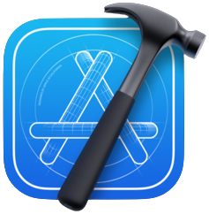

<h1 align="center">Hello , I'm Rivaldo</h1>
<h3 align="center">I'm passionate in Mobile Application Development.</h3>
 

## 🧐 About Me

- 👨🏻‍💻 I’m currently working as Tech Mentor at **[Orbit Future Academy](https://orbitfutureacademy.id/)**
  
- 👨🏼‍🔬 I'm graduate of **[Apple Developer Academy @Infinite Learning Batam, Indonesia](https://www.developeracademy.infinitelearning.id/)**

- 🧮 My specialization are Native **iOS Development** ❤️ and **Android Development**

- 📫 You can reach me at **rivaldofez@gmail.com** | rivaldofez@engineer.com or my **[Linkedin](https://www.linkedin.com/in/rivaldofez/)**

- 🤪 Fun fact **I like baking and doing homeworkout.**

## 🚀 Languages and Tools:

 
     
     
    
    
     
     
     
     
     
       
     
     
    
    

<!--       -->
 

## My Activity

## Github Stats

## Connect with me:

## ❤ Views and Followers

